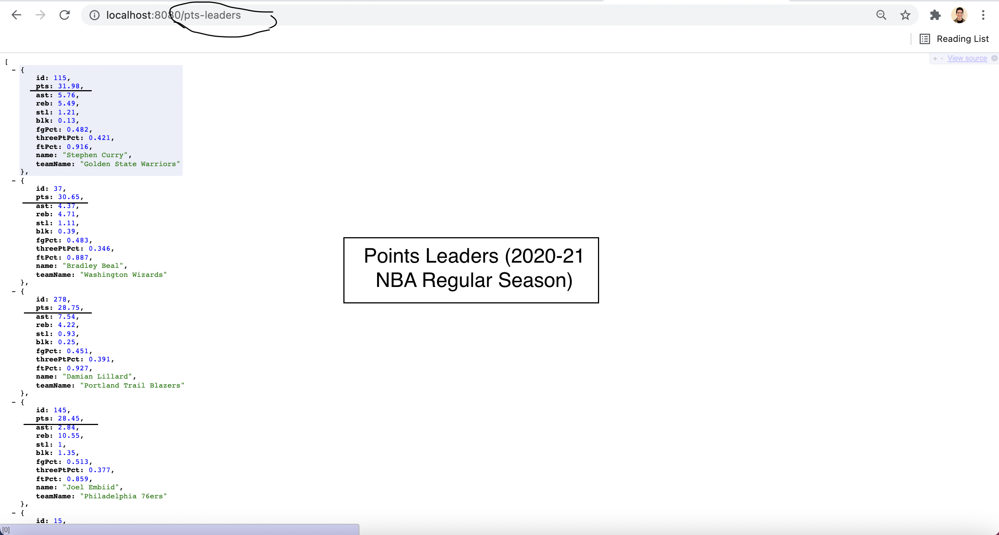
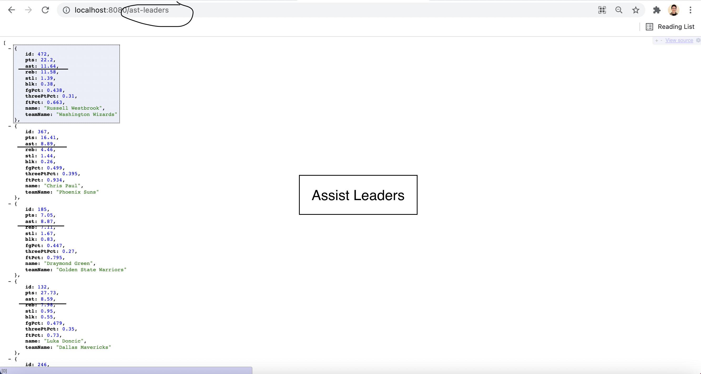
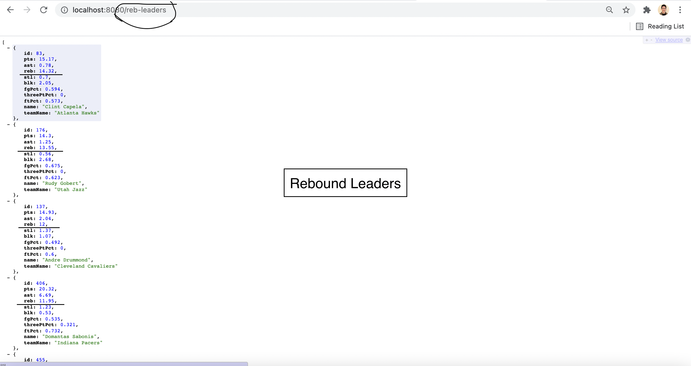
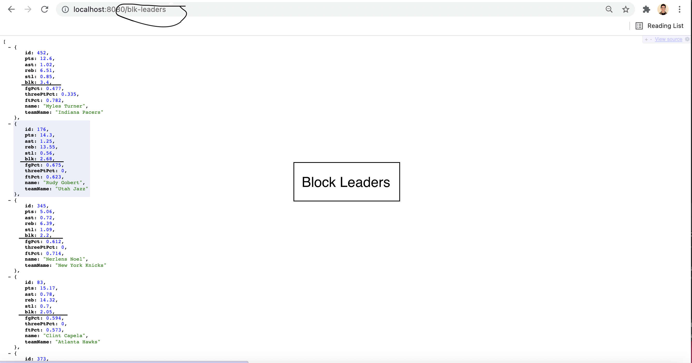

# NBAQuickStats 

## Description 

NBAQuickStats is a compact SpringBoot application that allows users to view NBA statistical leaders from the 2020-21 regular season. For instance, if you visit "/pts-leaders", you can see the top 50 players in the NBA in terms of points per game. Here are all of the relevant URLs/API endpoints: 
  * [BASE-URL]/pts-leaders: View (top 50) points per game leaders 
  * [BASE-URL]/ast-leaders: Assist leaders 
  * [BASE-URL]/reb-leaders: Rebounding leaders 
  * [BASE-URL]/blk-leaders: Blocks leaders 
  * [BASE-URL]/fg-pct-leaders: Field goal percentage leaders
  * [BASE-URL]/3pt-pct-leaders: Three point percentage leaders 
  * [BASE-URL]/ft-pct leaders: Free throw percentage leaders 

Note 1: Because the application doesn't necessarily look through all active players, it may miss a category leader here or there.

Note 2: All data access credit goes to the following API: https://www.balldontlie.io/. 

## Some Demo Images 

### Points Leaders 
 

## Assist Leaders 
 

### Rebound Leaders 
 

### Blocks Leaders 

